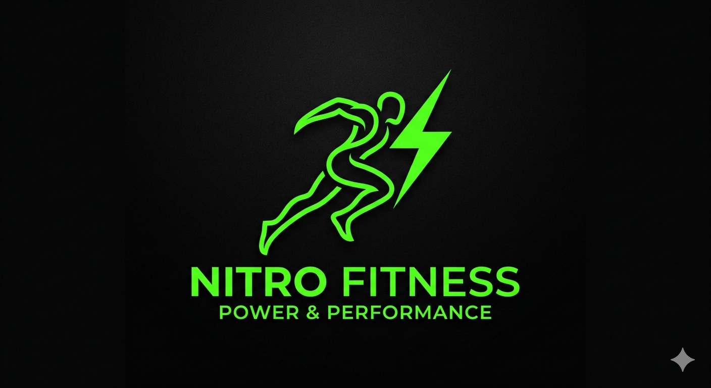

# Nitro Fitness - 30-Day Fat Loss Planner

Nitro Fitness is a premium, static Flutter mobile application designed to help users follow a consistent 30-day diet and workout routine to reduce belly fat and improve overall fitness.



## 🚀 Features

- **Personalized 30-Day Plan**: Each day features a specific diet routine and targeted fat-loss workouts.
- **Modern Dashboard**: Track your overall progress with a high-end visual ring and summary statistics.
- **Interactive Checklist**: Stay consistent by marking daily meals and exercises as completed.
- **Hydration Tracker**: Monitor your daily water intake with a dedicated tracking component.
- **30-Day Calendar**: Visualize your journey and easily navigate between different days of the plan.
- **Dark Mode Aesthetics**: A premium UI featuring glassmorphism, neon green accents, and smooth transitions.
- **Local Persistence**: All progress is stored locally on your device—no internet or account required.

## 🛠️ Tech Stack

- **Framework**: Flutter (Material 3)
- **State Management**: Provider
- **Local Storage**: Shared Preferences
- **Icons & Splash**: flutter_launcher_icons, flutter_native_splash

## 📂 Project Structure

```text
lib/
├── data/       # Static 30-day plan data
├── models/     # Fitness and Checklist data models
├── providers/  # State management and persistence logic
├── screens/    # Main application screens (Home, Calendar, Tasks)
└── widgets/    # Reusable UI components
```

## 🏁 Getting Started

### Prerequisites
- Flutter SDK installed on your machine.
- An IDE (VS Code, Android Studio) with Flutter extensions.

### Installation

1. **Clone the repository**:
   ```bash
   git clone <repository-url>
   ```

2. **Install dependencies**:
   ```bash
   flutter pub get
   ```

3. **Generate Launcher Icons & Splash**:
   ```bash
   flutter pub run flutter_launcher_icons
   flutter pub run flutter_native_splash:create
   ```

4. **Run the app**:
   ```bash
   flutter run
   ```

## 🎨 Branding

The app uses a custom-branded identity:
- **Theme**: Premium Dark (0xFF0A0A0A)
- **Primary Color**: Neon Green (0xFF00E676)
- **Logo**: Nitro Fitness (Power & Performance)

---
Developed with ❤️ by Antigravity.
